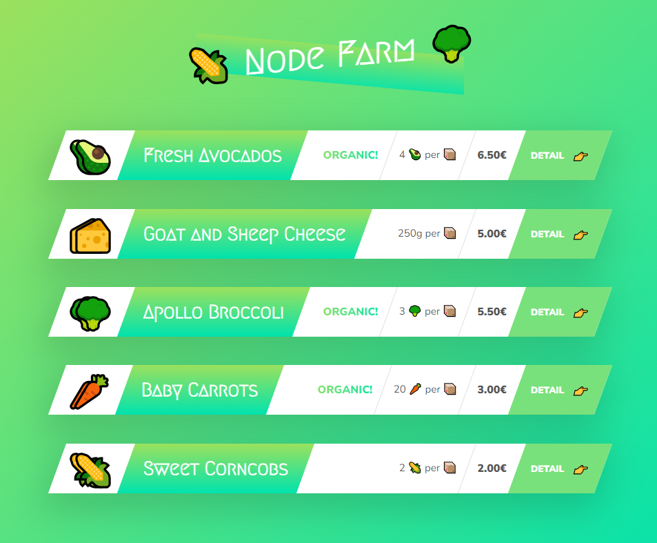

# Notes from Udemy course

> **_The best way to learn something is to write it down. In this particular paper I'll try to be as short as possible to make nice little notes for future needs in refreshing my knowledge.💝_**

## Section 1: Welcome, Welcome, Welcome!

These lessons provided me with refreshing knowledge about Node.js and structure of future lessons. I've got starter files and future project structure, configured my Node.js version and also got used to work with Visual Studio 💙.

## Section 2: Introduction to Node.js and NPM

### CORE MODULES

#### Require module "fs"

_Require_ and how to use it. Not something particular new for me, but first practical thing from course.

#### readFileSync()

Application of _readFileSync_ and _writeFileSync_. I've used prepared [text](./1-node-farm/starter/txt/input.txt) and outputted updated result into [new file](./1-node-farm/starter/txt/output.txt).

#### Blocking vs. non-blocking, synchronous vs. asynchronous.

Node.js process is only one single thread executed in machine processor. All users using node.js process use only one thread in computer.
One user using program in synchronous way is the reason why other users have need to wait until first task is finished.
The best way of creating such server that satisfy users without delays is using asynchronous way. Putting hard-processed things into background, easy tasks to execute in single tread synchronously.

**_Callbacks != asynchronous way!_**

> Once I've created a Telegram bot where there was huge calculating misconception about this. The task of the bot was generating picture with overlaid text and send picture anonymously to another user in bot. Everything was ok when one person is using bot. Other time there were huge crowd using it and it crashed so hard, because I haven't implemented any programming pattern (e.g. _factory_) and all tasks were running synchronously.

#### readFile() (asyncronous)

Asynchronous function readFile() has 3 main parameters.

1. Path to file
2. Encoding (usually 'utf-8')
3. Callback with 2 usual possible parameters. Error and data

You can operate data in the callback body, use data in another readFile() and perform various tasks.
Code sample from lesson:

    // Non-blocking
    // Read file start.txt
    fs.readFile('./txt/start.txt', 'utf-8', (err, data1) => {
        // Use string data1 from file and insert into another readFile
        fs.readFile(`./txt/${data1}.txt`, 'utf-8', (err, data2) => {
            console.log(data2);
            // Read another file, output string
            fs.readFile('./txt/append.txt', 'utf-8', (err, data3) => {
                console.log(data3);

                // Concatenate strings from two files and writing them  into another one
                fs.writeFile('./txt/final.txt', `${data2}\n${data3}`, 'utf-8', err => {
                    console.log('Your file has been written!');
                })
            });
        });
    });

---

### CREATING SIMPLE WEB-SERVER

#### Setting up server

We created single variable _server_ with module http and method _createServer_

#### createServer()

This method accepts callback function, which will be triggered every time we send request to our server. Function has 2 methods. **Request** and **Response**.

    const server = http.createServer((req, res) => {
        console.log(req.url);
    });

Both of them have lots of methods to deal with logic of server and app.
Method _listen_ starts listening for incoming requests on specified **port** and **ip-address**

    server.listen(8000, '127.0.0.1', () => {
    console.log('Listening to request on port 8000');
    });

#### Routing

The overall structure remains the same from previous lesson, except we added url module.
Url is the property of object _Request_ which basically tells us which routing is there.
The deviation in routs comes with logical if-statements. For example:

    const pathName = req.url;
    if (pathName === '/' || pathName === '/overview') {
            res.end('This is OVERVIEW');
        } else if (pathName === '/product') {
            res.end('This is the PRODUCT');
        }

#### API

API (application program interface) - service, which once triggered can give us information from application.
In example, we retrieved info from [file](./1-node-farm/starter/dev-data/data.json) by following code:

    else if ( pathName === '/api') {
        fs.readFile(`${__dirname}/dev-data/data.json`, 'utf-8', (err, data) => {
            const productData = JSON.parse(data);
            // console.log(productData);
            res.writeHead(200, { 'Content-type': 'application/json'});
            res.end(data);
        });
    }

**dirname stands for name of directory, where file is being executed, we improved code from './dev-data/...' to '${**dirname}/dev-data/...'.
Reading a file in the same manner as always through asynchronous readFile, but now we're:

1. Parsing the _data_ in callback using JSON.parse(data);
2. Writing head to response with code _200_ (Success);
3. Specifying content-type of response by setting 'Content-type': 'application/json'.
4. Sending response with res.end().

In the end of lecture we discussed some technique that allows more optimization. Practically speaking, doing blocking activity (such as reading file) on the top-level of code and sending same result over and over, once API is triggered.
We got the following code at the top-level:

    const data = fs.readFileSync(`${__dirname}/dev-data/data.json`, 'utf-8');
    const dataObj = JSON.parse(data);

And using it in API here:

    else if ( pathName === '/api') {
            res.writeHead(200, { 'Content-type': 'application/json'});
            res.end(data);
    }

#### HTML Templating: Building the Templates

Templates for project can be found in this [folder](./1-node-farm/starter/templates/).
Stylistic is incorporated in those files, so we don't have need to request different files with various formats from server.

Nevertheless, we changed some things in file template.html (now it's [template-product.html](./1-node-farm/starter/templates/template-product.html)).
First things first, we added tags in the following form \*\*, ,  etc.

It will help us later in the course in pasting values to template %{PRICE%}, , etc. from JSON object.

#### HTML Templating: Filling the Templates

In previous lesson we learned how to edit HTML and writing placeholders for other entities.

Now we read those templates in top-level code in blocking manner:

    const tempOverview = fs.readFileSync(`${__dirname}/templates/template-overview.html`, 'utf-8');
    const tempCard = fs.readFileSync(`${__dirname}/templates/template-card.html`, 'utf-8');
    const tempProduct = fs.readFileSync(`${__dirname}/templates/template-product.html`, 'utf-8');

And accessing JSON-file with _dataObj.map()_. Following logic behind:

> For each card object in JSON file substitude in a copy of template-card.html responding placeholders with values of said JSON object.

As a result we receive list of HTML templates from map callbacks with different values in templates, which we'll use in final overview page.

Final code for overview page:

    // Overview page
    if (pathName === '/' || pathName === '/overview') {
        res.writeHead(200, { 'Content-type': 'text/html'});

        const cardHtml = dataObj.map(el => replaceTemplate(tempCard, el)).join('');
        // console.log(cardHtml);
        const output = tempOverview.replace('', cardHtml);
        res.end(output);
    }

Results:

#### Parsing variables from URLs

Using _url.parse(url:string, true|false:boolean)_ we created 2 vars: **query** and **pathname**.

    Url {
        ...
        query: { id: '0' },
        pathname: '/product'
        ...
    }

The final goal for project is achieved be doing this:

    // Product page
    else if (pathname === '/product') {
        res.writeHead(200, { 'Content-type': 'text/html'});
        const product = dataObj[query.id];
        const output = replaceTemplate(tempProduct, product);
        res.end(output);
     }

Same as overview we expect plain HTML from server, then we select product based on query.id key from JSON file that we've read in the top-level.

---

### CREATING OUR OWN MODULES

In JS every single file considered separate module. So we can create our own modules.

#### Export and Require

We added separate dir called _modules_ and created [replaceTemplate.js](./1-node-farm/starter/modules/replaceTemplate.js).
Here we pasted replaceTemplate function, so in this way it does not in our main program.
For adding function to our index.js we used **require**.

#### NPM & Types of Packages

Node.js is a package manager. It is kinda of software and library of packages, which can be used in project.
We created first package.json for purposes of initializing directory as project. That file includes information about project.

We divided development dependencies and regular.
Project uses regular dependencies on packages to operate.
Dev-dep are used by developers working on project, e.g. nodemon.

In addition, we've installed nodemon: locally (in project directory) and globally (across whole system). Then we used nodemon package for continuous restart of server, whether we make some changes to files.

#### Adding third-party modules

In lesson, it's been used the slugify module. Simple library for string manipulation, which takes e.g. 'Fresh Avocados' into 'fresh-avocados'. It can be used in creating meaningful routes, such as 'node-farm/product/fresh-avocados' instead of '...?id=0'.

#### Package versioning

Let's take e.g from our package.json. Nodemon currently has '^3.0.1' version, where:

- 3 -- major version. Huge new release, which can have breaking changes. Code might not work (changed module name for e.g.).
- 0 -- minor version. Introduced some new features, without breaking old ones. It's compatible with previous programs, where used.
- 1 -- patch version. Intended for fix bugs.

Packages can be installed and deleted. To active this use:

- npm i or npm install node_module_name
- npm uninstall node_module_name.

#### Setting up Prettier

Dotenv -- highlighting the env vars in code
ESlint -- program to find bugs
Image preview -- display images from code
Prettier -- formatting code according to rules
Pug beautify -- for building templates
TODO highlight -- highlight TODO (BUG and FIXTHIS)
Oceanic Next -- theme in course

We've configured .prettierrc file with parameters for formatting code and documents in VS-code.

#### Recap of 1st Section

We've received good foundation for rather Node.js understanding.

> As for me, 1st section did good work, because it refreshed my existing knowledge and simultaneously gave a few new things to consider. Now I know how HTML-templates work. What server do with them, how to use regular expressions to substitute HTML-text and how to send different pages to client from server-side. Also, I gained some basic knowledge about routing and definitely use it for future projects.

---

## SECTION 3. INTRODUCTION TO BACK-END DEVELOPMENT

#### An overview How Web works

Client sends a request to server and server sends back a response. **This called Request-response model** or **Client-server architecture**.

In 'https://www.google.com/maps' there is several things:
1. HTTP or HTTPS -- protocol
2. Google.com -- domain name
3. Maps -- resource

Google.com **is not** server location. DNS via DNS lookup (like in table) find corresponding to google.com **real** ip-address of server.

Other thing to mention is HTTP Request and Response.

#### Backend and Frontend

Frontend - HTML, CSS, JS, React, Redux etc. How site looks in browser.
Backend - what happens in web-server, not visible to user.

Server - computer connected to internet that has resources and documents.

Browser communicates with HTTP server and server operates files in its system and responds accordingly.

Simple web-server can be called static. All what it does is sending plain HTML files to clients.
Dynamic web-server is server, which is running and form the app, with access to files.

Database can be used to store users, texts, images and so on.

Server-side is responsible for all functionality of an app. Answering requests and give response, manipulate data in server's computer or mutilate the database. 

#### Static vs Dynamic vs API

Static website consist of server, which sends to the client simple resources such as said document (HTML), stylistic (CSS) and animation (JavaScript). Client can not mutilate server information and resources, it can simply access them.

Dynamic website, on the other hand, can provide user with different information each time user access website. Information even can be refreshed due to changes of other users or own server, for e.g. twitter feed.

API is basically programming interface of server, that can be accessed by other programs. API responds with JSON-type file and other program used information in this file to fill own templates.

---

## SECTION 4. HOW NODE.JS WORKS: A LOOK BEHIND THE SCENES

Node runtime has several dependencies V8 and libuv.

V8 is engine that translates JavaScript code into binary machine-readable format acceptable for execution on low-level.

libuv - open-source library that gives node.js an ability to be asynchronous with access to system I/O.

V8 is written with JS and C++.
libuv is written with C++.

File reading and writing in node.js comes from libuv C++ implementations.

#### Node process and threads

When we use Node.js it means that there's process running on that computer. And process is a C++ program in execution and it has single *thread*.
**Node runs in the single thread.**
No matter whether one user uses server or million of them.
Expensive tasks can be loaded into thread pool (Thread #1-4). Node does this automatically.

#### Event loop

Node.js process > single thread > event loop
Some tasks can be loaded into thread pool.

Event loop consists of:

* All code inside of callback function is handled by it
* node built around callback function
* node execute callback when events are emmited
* event loop does an orchestration: execute easier task, load expensive one to thread pool.

##### Order of execution
1. When we start Node application event loop starts running.
2. Event loop has multiple phases and each one has own **callback queue**, which are callbacks coming from the events that event loop receives.
3. There is not one callback queue, there is several of them.

The phases of Node.js Event loop and there respective queues:
1. Expired timer callbacks (setTimeout()). 
2. I/O polling and callbacks. Looking for I/O events, file access
3. setImmediate callbacks. Process callbacks immediately after I/O polling.
4. Close callbacks. All close events are processed. E.g. when server shut down.

There are other queues:
1. Process.nexttick() queue.
2. Other microtasks queue (resolved promises)
3. Promise callbacks queue will be executed between previous phases.

If there are any timers or I/O pending then event loop will start over.

> When we listening for incoming HHTP request we running I/O task and that is why event loop keep running and listening and don't stop.

Event loop is what makes asynchronous design possible!
In Node.js everything works in same thread. It gives possible to scale app without dependence on computer resources, but comes with a great cost: some processes can be block execution of other part of program, therefore you need to be precise with code and heavy functions.

What can block thread from further execution:

* sync version of functions in fs, crypto and zlib modules in callback functions
* complex calculations (e.g. loops inside loops)
* need to be careful with JSON in large objects
* complex regular expressions (e.g. nested quantifiers)

#### Node.js processes queue in practice

We created a [file](./starter/event-loop.js) with several functions and their callback to demonstrate how event loop's queues work.

We used module crypto to demonstrate how thread pool works and by changing number of threads (from 1 up to 4, 4 is default) it was measured the speed of completion of said crypto tasks.

I'll return to this lesson later, as I don't get everything and missed some points.

#### Event-driven architecture

In node.js there is event emitters that emit events, for e.g. request hitting server, timer expiring, file finished reading.
These events are read by **event listeners** that developers have set up, and they react by callback function.
Basically, according to event there is setted listener that calls callback function.

*Server.on* here is listener for *request event*. The server acts like an emitter and automatically emit an event 'request' each time a request hits the server.
Callback function will be called on certain event 'request'.

Event and listener model is called **observer** pattern in JavaScript and in general.
This pattern is designed to react, but not to call the function.

Event driven architecture makes easy to react to the same event, from different sources.

You can access file.js example in [events.js](./2-how-node-works/starter/events.js).

#### Intro to Streams

Streams are used to process (read and write) data piece by piece (chunks), without completing the whole read or write operation, and therefore without keeping all the data in memory.

* Perfect for handling large volumes of data (e.g. video)
* more efficient data processing in terms of memory (no need to keep all data in memory) and time (we don't have to wait till all data is available).

> Streams are instances of EventEmitter class

In node there is several types of streams.

#### CommonJS module system. Requiring.
* Each JS file is treated as separate module.
* Node.js uses CommonJS module system: *require(), exports or module.exports*.
* ES module system is used in **browsers**: import/export.

#### Recap of 4th Section

This was quite handful on theory section, which briefly introduced to what happens behind scenes of Node.js. Topic covered in Section 4 include:
1. [Base of Node.js](#section-4-how-nodejs-works-a-look-behind-the-scenes): Google's V8, Libuv (asyncronous) and C++ file reading+writing.
2. [Processes, Threads and Thread Pool](#node-process-and-threads). How Node.js manage to work simultaneously with only single thread
3. [The Event loop](#event-loop). Order in which callbacks are called and subsequent queues.
4. [Events and event driven architecture](#event-driven-architecture). Observer pattern, emitters of events and listeners for said events.
5. [Streams](#intro-to-streams). Way of reading and writing data by segments or chunks.
6. [Behind the Require](#commonjs-module-system-requiring). Function-wrapper, order of importing, usage exports.

---

## SECTION 5. PROMISES.

#### The problem with callback hell

Callback hell is antipattern that can be described as code in asynchronous programming, where callbacks and if-else statements nested in themselves several times forming lefty triangular shape.
This pattern is better to avoid, because code containing callback hell can quickly become problem for scaling, maintaining and debugging of project. Also, such code is worse to understand, than by using for e.g. ***promises***. 

#### Intro to Promises

Promise implements a concept of future value, of what we expect, but returned in some time in the future.
Promise in the beginning is ***pending***.
When promise got a data than it is ***resolved***.
Resolved promise can not always be successful:
1. When there is result we want to use, then it is ***fulfilled***.
2. Whem there is error, then it is ***rejected***.

**Then** method handles only successful promises.
**Catch** method comes with error handling (rejected promises).

This is how we *consume* promises.

#### Async & await

Promises can be used more consistently using try/catch and async/await.
***Async*** is a key word, which placed upon function makes it a **promise**.
In this function we can block code from execution with key word ***await***. Doing so we wait until promise asynchronous task is finished, then we proceed operate with returned value.

Async and await is syntax sugar and can substitute the existing .then().catch() methods. 

    (async () => {
        try {
            console.log('1: Will get dog pictures');
            console.log(await getDogPicture()); // returns "2: READY!"
            console.log('3: Done getting dog pictures');
        } catch (err) {
            console.log('ERROR' + err);
        }
    })();

It this example we used asynchronous anonymous function, which we called right away.
We waited till finishing getDogPicture() (because it's also asynchronous function), then displayed values in order 1, 2, 3.
Without await step #2 would be displayed in the end, after 1&3, because of nature of event loop.

## SECTION 6: BUILDING API WITH EXPRESS.JS 
