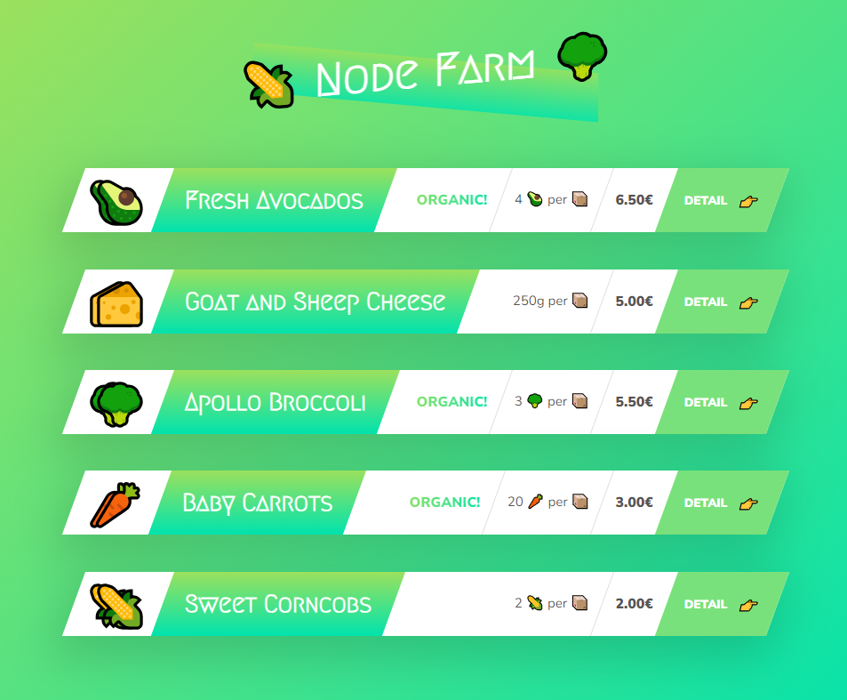

# Notes from Udemy course

> ***The best way to learn something is to write it down. In this particular paper I'll try to be as short as possible to make nice little notes for future refreshing knowledge.💝 They'll be also very cute tho💫***

## Section 1: Welcome, Welcome, Welcome!

 These lessons provided me with refreshing knowledge about Node.js and structured future lessons. I've got starter files and future project structure, configured my Node.js version and also got used to work with Visual Studio 💙.

## Section 2: Introduction to Node.js and NPM

### CORE MODULES

#### Require module "fs"
*Require* and how to use it. Not something particulary new for me, but first practical thing from course. 

#### readFileSync()
Application of *readFileSync* and *writeFileSync*. I've used prepared [text](../starter/txt/input.txt) and outputed updated result into [new file](../starter/txt/output.txt).

#### Blocking vs. non-blocking, synchronous vs. asynchronous.

Node.js process is only one single thread executed in machine processor. All users using node.js process use only one thread in computer. 
One user using program in synchronous way is the reason why other users have need to wait until first task is finished.
The best way of creating such server that satisfy users without delays is using asynchronous way. Putting hard-processed things into background, easy tasks to execute in single tread synchronously. 

***Callbacks != asynchronous way!***

> Once I've created a Telegram bot where there was huge calculating misconception about this. The task of the bot was generating picture with overlayed text and send picture anonymously to another user in bot. Everything was ok when one person is using bot. Other time there were huge crowd using it and it crashed so hard, cause I haven't implemented any programming pattern (e.g. *factory*) and all tasks were running synchronomously...

#### readFile() (asyncronous)
Asyncronous function readFile() has 3 main parameters.
1. Path to file
2. Encoding (usually 'utf-8')
3. Callback with 2 usual possible parameters. Error and data

You can operate data in the callback body, use data in another readFile() and perform various tasks.
Code sample from lesson:

    // Non-blocking
    // Read file start.txt
    fs.readFile('./txt/start.txt', 'utf-8', (err, data1) => {
        // Use string data1 from file and insert into another readFile 
        fs.readFile(`./txt/${data1}.txt`, 'utf-8', (err, data2) => {
            console.log(data2);
            // Read another file, output string
            fs.readFile('./txt/append.txt', 'utf-8', (err, data3) => {
                console.log(data3);

                // Concatenate strings from two files and writing them  into another one
                fs.writeFile('./txt/final.txt', `${data2}\n${data3}`, 'utf-8', err => {
                    console.log('Your file has been written!');
                })
            });
        });
    });

---
### CREATING SIMPLE WEB-SERVER

#### Setting up server
We created single variable *server* with module http and method *createServer*
#### createServer()
This method accepts callback function, which will be triggered everytime we send request to our server. Function has 2 methods. **Request** and **Response**.

    const server = http.createServer((req, res) => {
        console.log(req.url);
    });

Both of them have lots of methods to deal with logic of server and app.
Method *listen* starts listening for incoming requests on specified **port** and **ip-address**

    server.listen(8000, '127.0.0.1', () => {
    console.log('Listening to request on port 8000');
    });

#### Routing
The overall structure remains the same from previous lesson, except we added url module.
Url is the property of object *Request* which basically tells us which routing is there.
The diviation in routs comes with logical if-statements. For example: 

    const pathName = req.url;
    if (pathName === '/' || pathName === '/overview') {
            res.end('This is OVERVIEW');
        } else if (pathName === '/product') {
            res.end('This is the PRODUCT');
        }

#### API
API (application program interface) - service, which once triggered can give us information from application.
In example we retrieved info from [file](./dev-data/data.json) by following code:

    else if ( pathName === '/api') {
        fs.readFile(`${__dirname}/dev-data/data.json`, 'utf-8', (err, data) => {
            const productData = JSON.parse(data);
            // console.log(productData);
            res.writeHead(200, { 'Content-type': 'application/json'});
            res.end(data);
        }); 
    }

__dirname stands for name of directory, where file is being executed, we improved code from './dev-data/...' to '${__dirname}/dev-data/...'.
Reading file in the same manner as always through asyncronous readFile, but now we're:
1. Parsing the *data* in callback using JSON.parse(data);
2. Writing head to response with code *200* (Success);
3. Specifing content-type of response by setting 'Content-type': 'application/json'.
4. Sending response with res.end().

In the end of lecture we discussed some technique that allows more optimization. Practically speaking, doing blocking activity (such as reading file) on the top-level of code and sending same result over and over, once api is triggered.
We got the following code at the top-level:

    const data = fs.readFileSync(`${__dirname}/dev-data/data.json`, 'utf-8');
    const dataObj = JSON.parse(data);

And using it in API here:

    else if ( pathName === '/api') {
            res.writeHead(200, { 'Content-type': 'application/json'});
            res.end(data);
    }

#### HTML Templating: Building the Templates
Templates for project can be found in this [folder](./templates/).
Stylisation is incorporated in those files, so we don't have need to request different files with various formats from server.

Nevertheless, we changed some things in file template.html (now it's [template-product.html](./templates/template-product.html)).
First things first, we added tags in the following form **, ,  etc.

It will help us later in the course in pasting values to template %{PRICE%}, , etc. from JSON object.

#### HTML Templating: Filling the Templates
In previous lesson we learned how to edit html and writing placeholders for other entities.

Now we read those templates in top-level code in blocking manner:

    const tempOverview = fs.readFileSync(`${__dirname}/templates/template-overview.html`, 'utf-8');
    const tempCard = fs.readFileSync(`${__dirname}/templates/template-card.html`, 'utf-8');
    const tempProduct = fs.readFileSync(`${__dirname}/templates/template-product.html`, 'utf-8');

And accessing JSON-file with *dataObj.map()*. Following logic behind:

> For each card object in JSON file substitude in a copy of template-card.html responding placeholders with values of said JSON object.

As a result we receive list of html templates from map callbacks with different values in templates, which we'll use in final overview page.

Final code for overview page: 

    // Overview page
    if (pathName === '/' || pathName === '/overview') {
        res.writeHead(200, { 'Content-type': 'text/html'});

        const cardHtml = dataObj.map(el => replaceTemplate(tempCard, el)).join('');
        // console.log(cardHtml);
        const output = tempOverview.replace('', cardHtml);
        res.end(output);
    } 

Results:

#### Parsing variables from URLs
Using *url.parse(url:string, true|false:boolean)* we created 2 vars: **query** and **pathname**.

    Url {
        ...
        query: { id: '0' },
        pathname: '/product'
        ...
    }

The final goal for project is achived be doing this:

    // Product page
    else if (pathname === '/product') {
        res.writeHead(200, { 'Content-type': 'text/html'});
        const product = dataObj[query.id];
        const output = replaceTemplate(tempProduct, product);
        res.end(output);
     }

Same as overview we expect plain html from server, then we select product based on query.id key from JSON file that we've read in the top-level.

---
### CREATING OUR OWN MODULES

In JS every single file considered separate module. So we can create our own modules.

#### Export and Require

We added separate dir called *modules* and created [replaceTemplate.js](./modules/replaceTemplate.js).
Here we pasted replaceTemplate function, so in this way it does not in our main program.
For adding function to our index.js we used **require**.

#### NPM & Types of Packages

Node.js is a package manager. It is kinda of software and library of packages, which can be used in project.
We created first package.json for purposes of initialising directory as project. That file includes information about project.

We divided development dependencies and regular.
Project uses regular dependencies on packages to operate.
Dev-dep are used by developers working on project, e.g. nodemon.

In addition, we've installed nodemon: locally (in project directory) and globally (across whole system). Then we used nodemon package for continious restart of of server, whether we make some changes to files.

